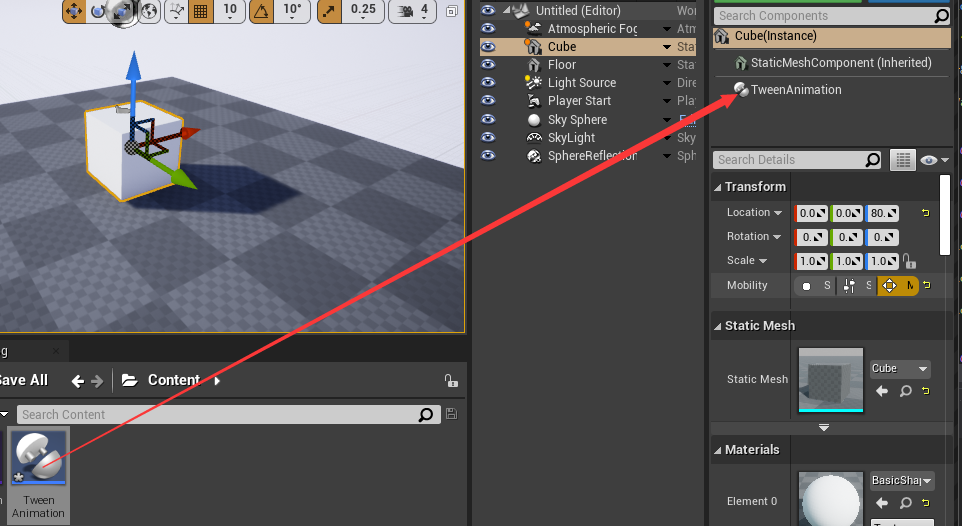
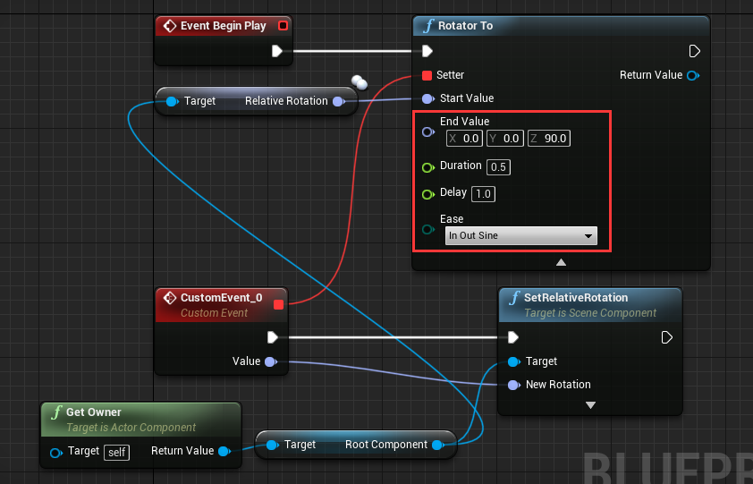

# 创建自定义的补间动画
LTween 提供了一些通用的动画方法: "Float To", "Int To", "Vector2 To", "Vector3 To", "Vector4 To", "Color To", "LinearColor To", "Quaternion To", "Rotator To". 有了这些方法, 你甚至可以为UMG制作补间动画.  

我们以 "Rotator To" 为例, 以此来旋转一个立方体网格物体.

## 设置场景
创建个新的场景, 放入一个立方体, 把 "Mobility" 设为 "Movable", 把位置设为 (0, 0, 80):

创建个 ActorComponent 蓝图, 命名为 "TweenAnimation":

把 "TweenAnimation" 组件拖拽到立方体上作为其组件:

从 "Event Begin Play" 拉线出来连到 "Rotator To" 节点:

## 设置 "Setter" 参数
**"Setter" 是 LTween 的 delegagte(委托), LTween会计算从 "Start Value" 到 "End Value" 的插值, 然后通过 "Setter" 把计算出来的结果传递给用户.**

从 "Setter" 拉线然后选择 "Add Event"->"Add Custom Event", 然后一个新的事件就用创建出来，参数是 rotator:

设置刚才创建的事件为下图这样:

## 设置其他参数
从 "Root Component" 节点拉线出来选择 "Get Relative Rotation", 然后连接到 "Start Value":

设置 "End Value" 值为 (0, 0, 90), "Duration" 值为 3.0, 设置 "Delay" 值为 1.0:

现在设置完成了, 点击 Play 可以看到刚才设置的动画.