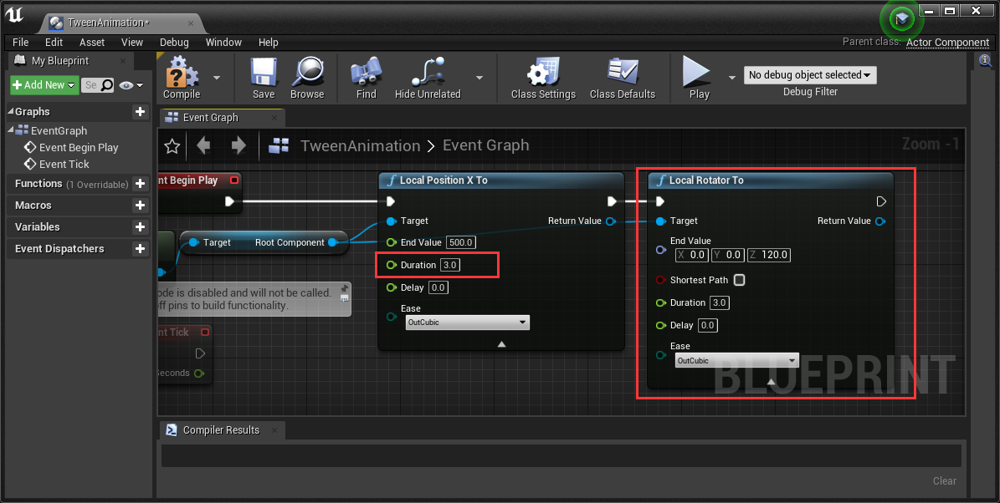
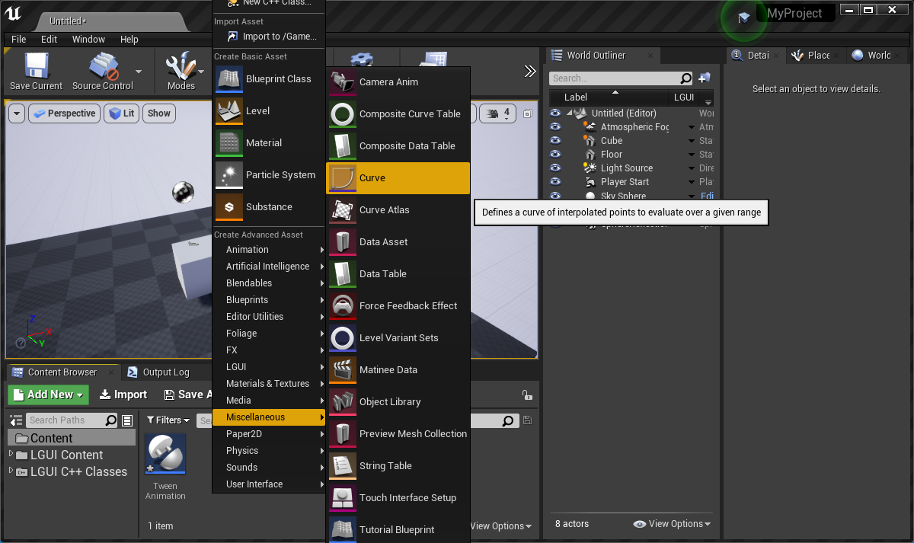
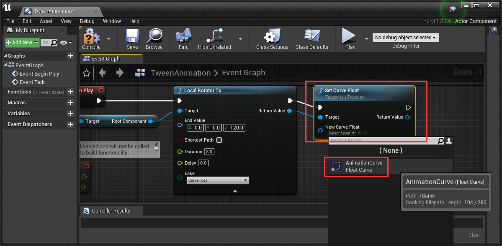

# 在 SceneComponent 使用 LTween

## 移动/旋转/缩放 动画
创建个新的默认场景, 放置个立方体到场景里, 设置 "Mobility" 为 "Movable“, 设置位置为 (0, 0, 80):  

创建个 ActorComponent 蓝图, 命名为 "TweenAnimation":  

编辑 TweenAnimation 蓝图内容像下图这样, 这样将会把立方体的相对坐标的x轴移动到 "EndValue":  

拖拽 TweenAnimation 蓝图到立方体上作为其组件，然后点击 Play 运行, 立方体将会用0.5秒种的时间移动到 (500, 0, 80):  

这个动画看起来很简单, 我们来把它弄得更有趣些. 双击打开 TweenAnimation 蓝图, 修改 "Duration" 值为 3.0. 像下图这样添加 "Local Rotator To" 节点:  

点击 Play 运行, 立方体将会移动和旋转:  

像下图这样添加 "Local Scale To" 节点, 然后点击 Play 运行:  

你也可以在 "TWeen" 分类里找到其他的一些动画方法 "LTween":  

## 延迟和缓动方式
删除 "Local Position X To" 和 "Local Scale To" 节点, 保留 "Local Rotator To" 节点, 然后设置 "Delay" 参数为 1.0, 点击 Play 运行 (动画将在运行后1秒钟开始):  

LTween 提供了多个缓动类型, 点击 "Ease" 然后选择你需要的缓动方式. [这个网站](https://www.inkfood.com/tween-3d-objects/) 可以作为缓动方式的参考 (下图也是来源于这个网站 https://www.inkfood.com/tween-3d-objects/):  

  
### 缓动曲线
有个特殊的缓动类型是 "CurveFloat":  

这个类型可以让我们用个 CurveFloat 来控制我们的动画. 以下步骤将会告诉我们如何去使用:
右键点击 Content 的空白出, 选择 "Miscellaneous"->"Curve":  

在弹出菜单中选择 "CurveFloat":  

把创建出来的资产命名为 "AnimationCurve":  

LTween 把水平方向的0到1的范围当作动画时间的开始和结束, 在这个范围内可以做你想要的任何的曲线:  

打开 "TweenAnimation" 蓝图，从"Local Rotator To" 节点的 "Return Value" 拉线出来, 然后天津个新的节点 "Set Curve Float", 然后在 "New Curve Float" 参数里选择 "AnimationCurve", 这样 CurveFloat 就能起作用了:  

## 循环
循环在补间动画里也是个非常重要的部分.  
从 "Set Curve Float" 节点后面的 "Return Value" 拉线出来， 选择 "Set Loop" 节点:  

点击 "New Loop Type" 可以看到有4个选项:  
- **Once** 动画执行一次，没有循环  
- **Restart** 每次动画循环都从头开始  
- **Yoyo** 在每次动画循环结束后都会交替方向
- **Incremental** 在每次动画循环结束后都增加，就像这样： A to B, B to B+(A-B), ...  

不要忘了设置 "New Loop Count", 0 或 1 代表没有循环, -1 代表无限循环.

## 事件
动画事件也是补间动画里不能忽略的功能.
LTween 提供了这些事件:  
- **OnStart** 当动画开始的时候执行, 如果有延迟(Delay), 那么将在延迟之后执行  
- **OnUpdate** 当动画开始后每一帧都执行  
- **OnComplete** 当动画完成的时候执行, 如果有循环那么就在所有循环都结束之后再执行
- **OnCycleStart** 动画循环的每一次开始的时候执行  
- **OnCycleComplete** 动画循环的每一次结束的时候执行
设置这些事件也很简单. 以 OnUpdata 为例, 从 "Return Value" 拉线出来选择 "On Update" 节点, 从 "New Update" 拉线出来添加新的自定义事件, 这个事件将会在动画开始后的每一帧执行:  

## Functions
- **Pause/Resume** Pause/Resume this animation  
- **Restart** Restart animation  
- **Goto** Send the tween to the given position in time  
- **Kill/KillIfIsTweening** Kill the tween if the animation already start  
- **ForceComplete** Force complete this animation at this frame, call OnComplete  

## Use LTween for Material

LTween provide "Material Vector Parameter To" and "Material Scalar Parameter To" nodes for "Material Instance Dynamic" objects:  

