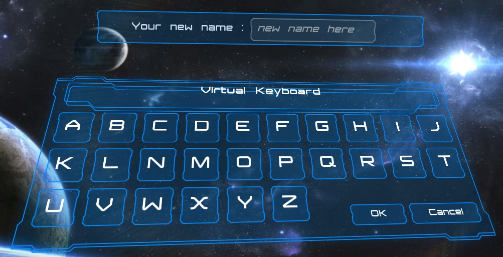

# 样例工程

## 汽车配置器

从这里获取： [github](https://github.com/liufei2008/LGUI-Sample--CarCustomization.git).
这是个汽车配置器项目.
功能点:
* 屏幕空间 3D UI
* 世界空间 3D UI
* UI 动画

## 教程项目

从这里获取： [github](https://github.com/liufei2008/LGUI_Tutorial.git).
这个工程中包含了多个场景，展示了LGUI的多项功能特点。
功能点:
* 拖拽释放
* 布局
* 预制体
* 控制器输入
* 文字动画
* 类似 "全境封锁" 的 UI
* VR

## 科技感 UI

从这里获取： [github](https://github.com/liufei2008/LGUISampleProject.git).