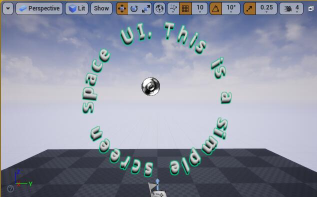

# LGUI Documentation

<h3><a href="LGUI/index.md">LGUI Manual</a></h3>

Learn how to use LGUI in UnrealEngine

<h3><a href="CurvyText/index.md">CurvyText Manual</a></h3>

Introduce to CurvyText for LGUI

