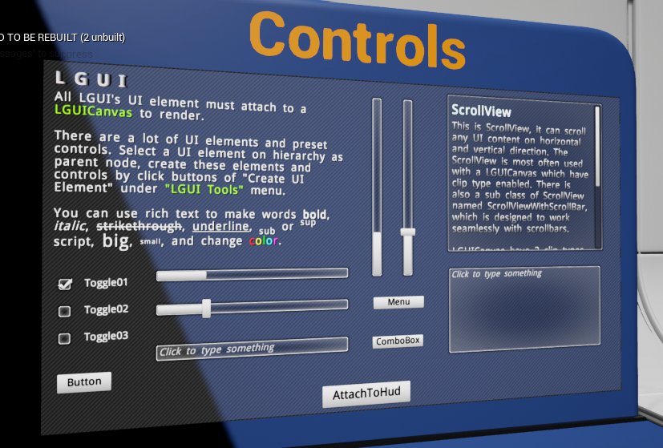

# LGUI Mannual

These pages contain information about how to use LGUI.

## Sections

<h3><a href="GetStarted/index.md">Get started</a></h3>

Start to use LGUI, component based workflow

<h3><a href="SampleProjects/index.md">Sample Projects</a></h3>

Introduce sample projects, and download these projects from github

<h3><a href="UIElementsAndControls/index.md">UI elements and controls</a></h3>

How to use LGUI's element and controls

<h3><a href="Layout/index.md">Layout</a></h3>

Use Layout to control location and size of UI

<h3><a href="LGUIPrefab/index.md">LGUIPrefab</a></h3>

Use LGUIPrefab workflow

<h3><a href="LGUIPointerEvent/index.md">LGUIPointerEvent</a></h3>

LGUIPointerEvent for UI interaction

<h3><a href="LGUIDrawableEvent/index.md">LGUIDrawableEvent</a></h3>

Introduce how to use LGUIDrawableEvent

<h3><a href="InputModule/index.md">InputModule</a></h3>

Input module

<h3><a href="LTween/index.md">LTween</a></h3>

LTween for tween animation

<h3><a href="ReleaseNotes/index.md">ReleaseNotes</a></h3>

ReleaseNotes contains: updates/ new features/ modify/ bug fix

